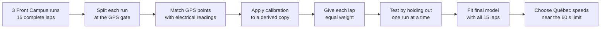
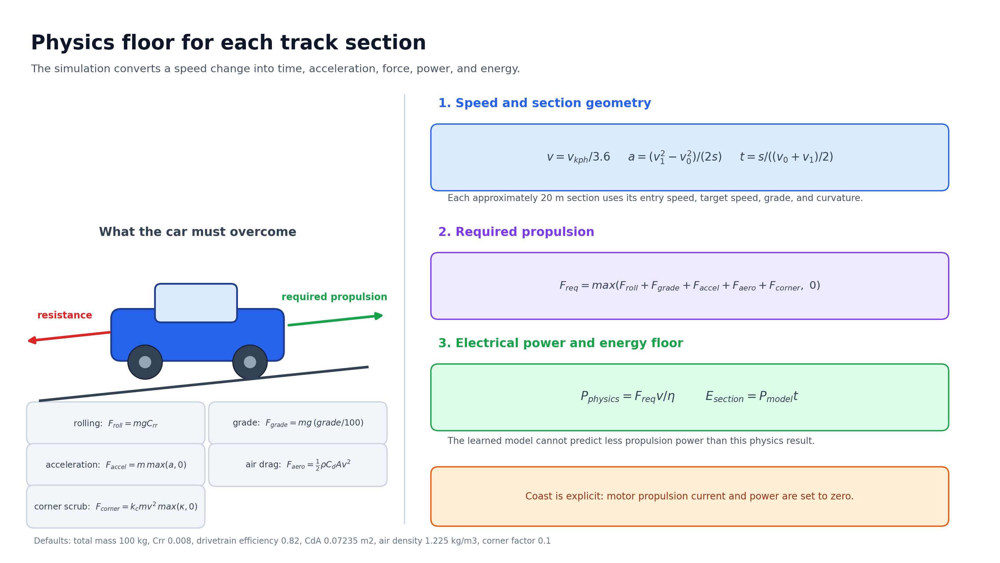
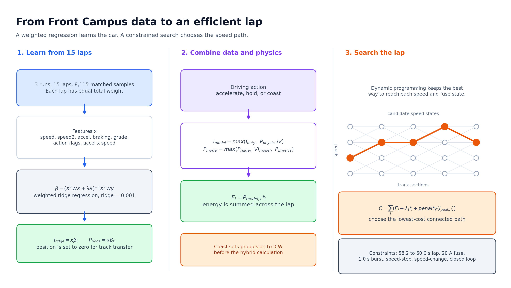

# Front Campus Physics Model

## How it works

The source CSV files stay unchanged. The loader creates calibrated current,
power, speed, acceleration, grade, and energy fields for model training. Every
row keeps its run and lap ID so values cannot carry across run boundaries.

The model does not use the Front Campus track position. It learns how speed,
acceleration, grade, and driving action relate to current and power. This lets
the fitted vehicle behaviour transfer to the Autodrome Chaudière geometry.

## Physics used in each track section

The Autodrome lap is divided into 20 sections of about 20 m. For each possible
speed change, the simulation calculates section time and acceleration:

$$
v = \frac{v_{kph}}{3.6}, \qquad
a = \frac{v_1^2-v_0^2}{2s}, \qquad
t = \frac{s}{(v_0+v_1)/2}
$$

In simple terms, a bigger speed increase over the same distance needs more
acceleration. A slower average speed takes more time to cross the section.

The required propulsion force is:

$$
F_{req}=\max(F_{roll}+F_{grade}+F_{accel}+F_{aero}+F_{corner},0)
$$

The five terms cover tire rolling resistance, hill grade, positive
acceleration, air drag, and extra tire scrub in a corner. Total mass is the
50 kg vehicle plus a 50 kg driver. The model converts force to electrical
power with the 82 percent drivetrain efficiency:

$$
P_{physics}=\frac{F_{req}v}{\eta}, \qquad E_{section}=P_{model}t
$$

This physics value is a floor for accelerate and hold sections. A coast action
is explicit and uses zero motor propulsion current and power.

## Math learned from Front Campus

The training rows use speed, speed squared, positive and negative
acceleration, uphill and downhill grade, driving action, and acceleration
multiplied by speed. Separate models are fitted for current and power with
weighted ridge regression:

$$
\beta=(X^T W X+\lambda R)^{-1}X^T W y
$$

Each lap has equal total weight, so a long lap or a run with more samples does
not control the result. The ridge value is 0.001. Absolute Front Campus track
position is set to zero, so the learned vehicle behaviour can be used on the
Autodrome geometry.

For accelerate and hold actions, the simulator combines the learned result and
the physics floor:

$$
I_{model}=\max(I_{duty},P_{physics}/V)
$$

$$
P_{model}=\max(P_{ridge},VI_{model},P_{physics})
$$

This keeps measured car behaviour in the model while preventing a prediction
that cannot supply the force required by the section.

## How the speed strategy is selected

Dynamic programming tries connected target speeds in 0.5 km/h steps. It keeps
the lowest-cost way to reach each speed and fuse state, then traces the best
full-lap path backward. The cost is:

$$
C=\sum_i(E_i+\lambda_t t_i+penalty(I_{peak,i}))
$$

Energy is the main target. The time term is adjusted until the lap is between
58.2 and 60.0 seconds. The current penalty begins at 75 percent of the 20 A
fuse limit and rises with the square of the excess:

$$
penalty_i=100wt_i
\left(
\frac{\max(I_{peak,i}-0.75I_{fuse},0)}{0.25I_{fuse}}
\right)^2
$$

The search also limits speed change to 5 km/h per section, rejects a predicted
over-fuse burst longer than 1.0 second, and requires the final speed to close
the loop within 0.5 km/h of the start speed.

## Validation

For each blue bar, that run was excluded from training and used only for the
test. Lower bars are better.

The Front Campus model reduces lap-energy error on all three held-out runs. It
does not reduce point-by-point current error, so the validation report keeps
both results visible. Energy prediction is the stronger result from this data.

## Québec strategy preview

The left plot shows target speed around the track. The right plot shows the
speed target by distance. Orange regions increase speed. Green regions coast.

The generated plan is a starting point. It still needs real Autodrome laps
before it should be treated as a measured race strategy.

The current output predicts a 59.2 second lap using 7.1782 kJ. Its targets
range from 18.5 to 30.5 km/h with 5 accelerate sections and 15 coast sections.

## Auditable outputs

- `data/models/front-campus-2026-08-06.json` selects the training runs and calibration.
- `autodrome-chaudiere-model.json` stores coefficients and source counts.
- `autodrome-chaudiere-model-validation.csv` stores held-out metrics.
- `autodrome-chaudiere-strategy-report.txt` summarizes the resulting plan.
- `plot_physics_math.py` regenerates both physics and math diagrams.
- The source GPX and telemetry files remain under `data/runs/`.
