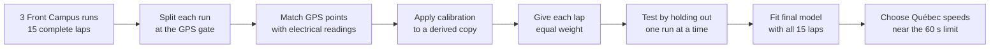
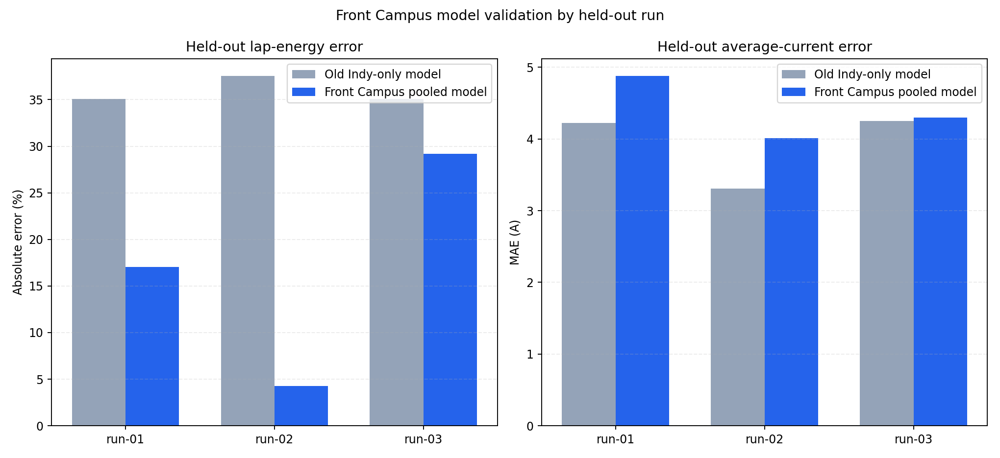
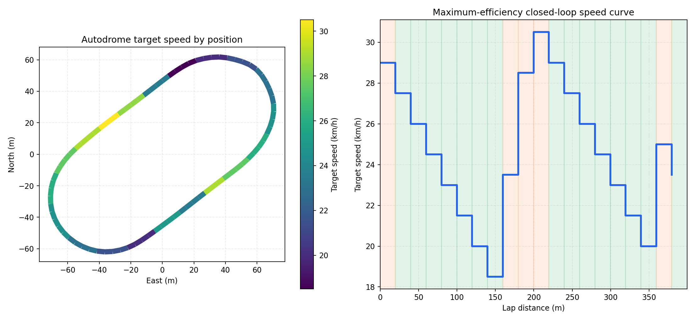

# Front Campus Physics Model

## How it works

The source CSV files stay unchanged. The loader creates calibrated current,
power, speed, acceleration, grade, and energy fields for model training. Every
row keeps its run and lap ID so values cannot carry across run boundaries.

The model does not use the Front Campus track position. It learns how speed,
acceleration, grade, and driving action relate to current and power. This lets
the fitted vehicle behaviour transfer to the Autodrome Chaudière geometry.

## Validation

For each blue bar, that run was excluded from training and used only for the
test. Lower bars are better.

The Front Campus model reduces lap-energy error on all three held-out runs. It
does not reduce point-by-point current error, so the validation report keeps
both results visible. Energy prediction is the stronger result from this data.

## Québec strategy preview

The left plot shows target speed around the track. The right plot shows the
speed target by distance. Orange regions increase speed. Green regions coast.

The generated plan is a starting point. It still needs real Autodrome laps
before it should be treated as a measured race strategy.

## Auditable outputs

- `data/models/front-campus-2026-08-06.json` selects the training runs and calibration.
- `autodrome-chaudiere-model.json` stores coefficients and source counts.
- `autodrome-chaudiere-model-validation.csv` stores held-out metrics.
- `autodrome-chaudiere-strategy-report.txt` summarizes the resulting plan.
- The source GPX and telemetry files remain under `data/runs/`.
